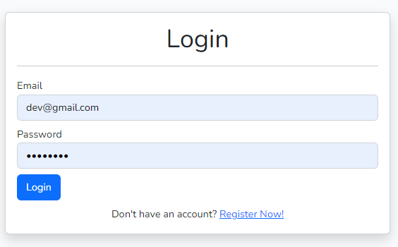
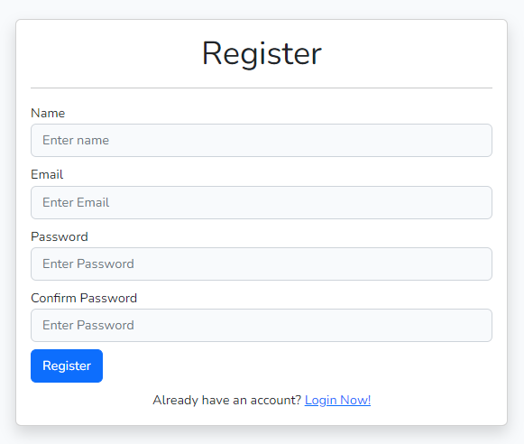
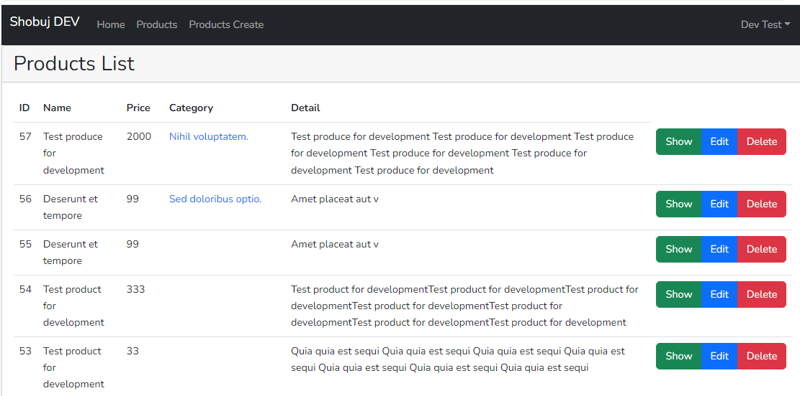
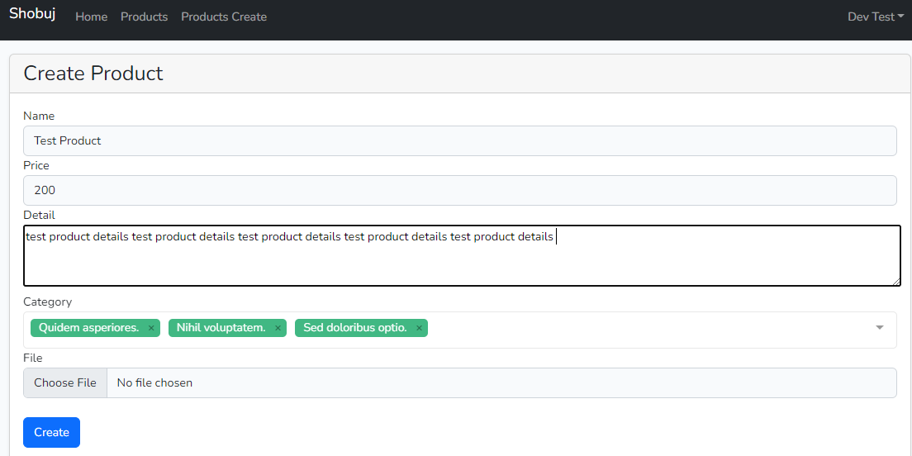
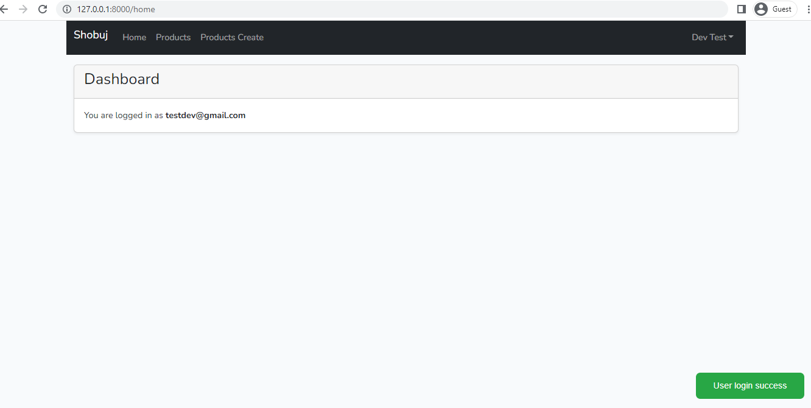
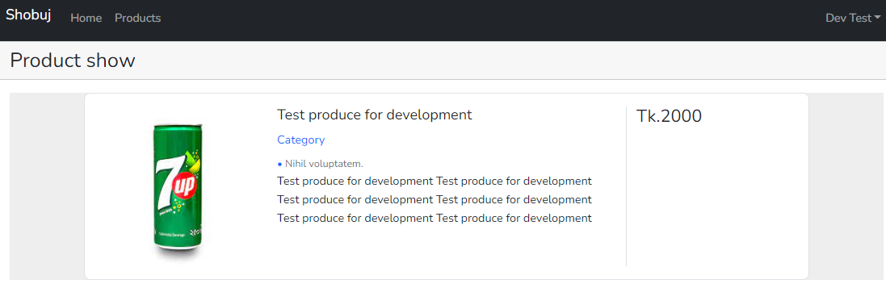
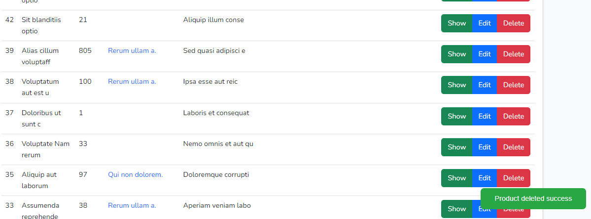

# Product management by Laravel 9 Sanctum, Vue 3 and Vite using repository pattern.

- Laravel 9
- Vue 3
- Vite
- Sanctum
- MySQL
- Rest API
- Repository Pattern
#

- Login



- Register



- Product list



- Product create



- Dashboard



- Product show



- Product delete




```
composer install
cp .env.example .env
php artisan key:generate
php artisan migrate
php artisan db:seed
php artisan storage:link
npm install
npm run dev
php artisan serve
```
